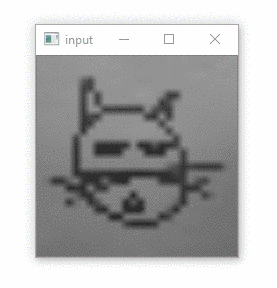
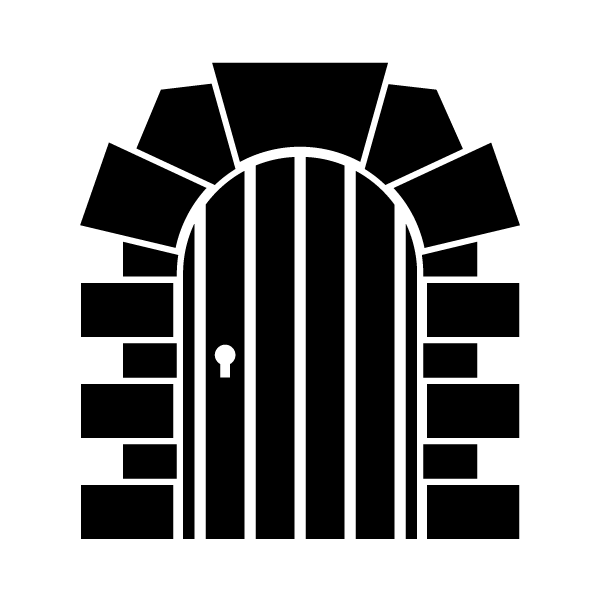

# Paint-n-Click
A point 'n click like game involving physically drawing the key objects to get them into the game to solve the puzzles.

Using Quick Draw bitmaps to identify doodles: https://www.tensorflow.org/datasets/catalog/quickdraw_bitmap  

We used the following tutorial: https://github.com/tensorflow/docs/blob/master/site/en/r1/tutorials/sequences/recurrent_quickdraw.md  

For the input of the model we use OpenCV to resize a webcam input to 28x28 grayscale.

