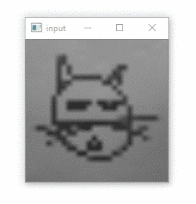
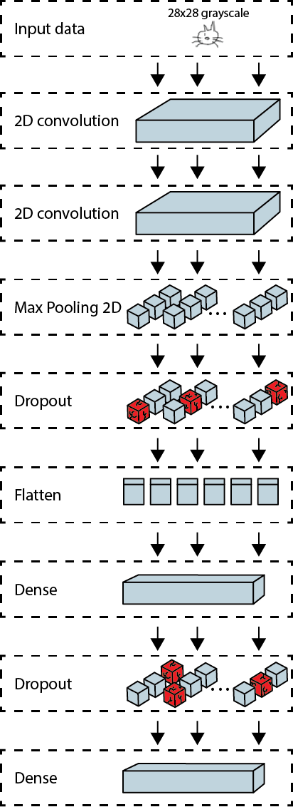

# Paint-n-Click
A point 'n click like puzzle game involving physically drawing the key objects to get them into the game to solve the puzzles.

Using Quick Draw bitmaps dataset to identify doodles with Tensorflow: https://www.tensorflow.org/datasets/catalog/quickdraw_bitmap  

We used the following tutorial for the TensorFlow model: https://github.com/tensorflow/docs/blob/master/site/en/r1/tutorials/sequences/recurrent_quickdraw.md  

## Contributors
[](https://github.com/Jessseee)
[](https://github.com/JonaMata)

# How it's done
The objective of the game is to answer riddles to be able to proceed through a randomly generated maze   


For the input of the model we use OpenCV to resize a webcam input to 28x28 grayscale.
as you can see in [drawing_camera.py](drawing_camera.py)
```
crop_frame = frame[self.y1:self.y2, self.x1:self.x2]
gray_frame = cv2.cvtColor(crop_frame, cv2.COLOR_BGR2GRAY)
kernel = np.ones((8, 8), np.uint8)
dilated_frame = cv2.erode(gray_frame, kernel)
resized_frame = cv2.resize(dilated_frame, (28, 28), cv2.INTER_NEAREST)
```


To recognize doodles drawn by the player a TensorFlow model is trained, a visualization of the different layers can be seen bellow.
The code to train the model can be found in [train_model.py](tensorflow_files/train_model.py).


